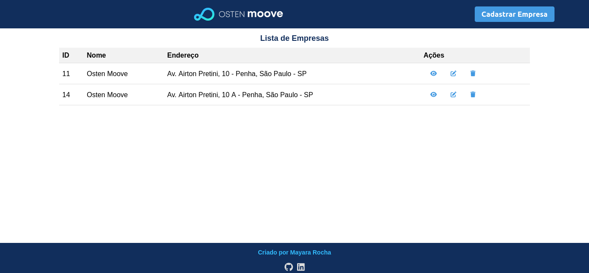
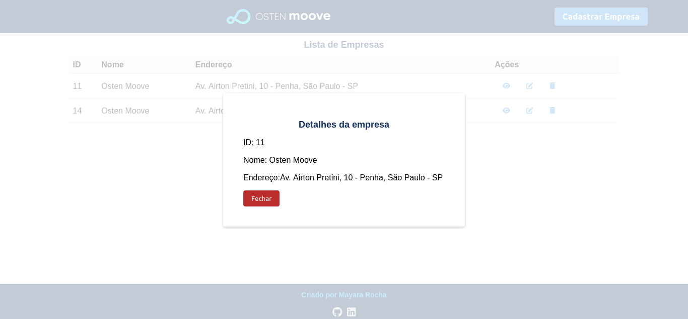
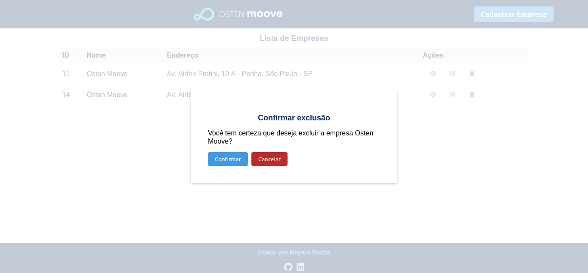
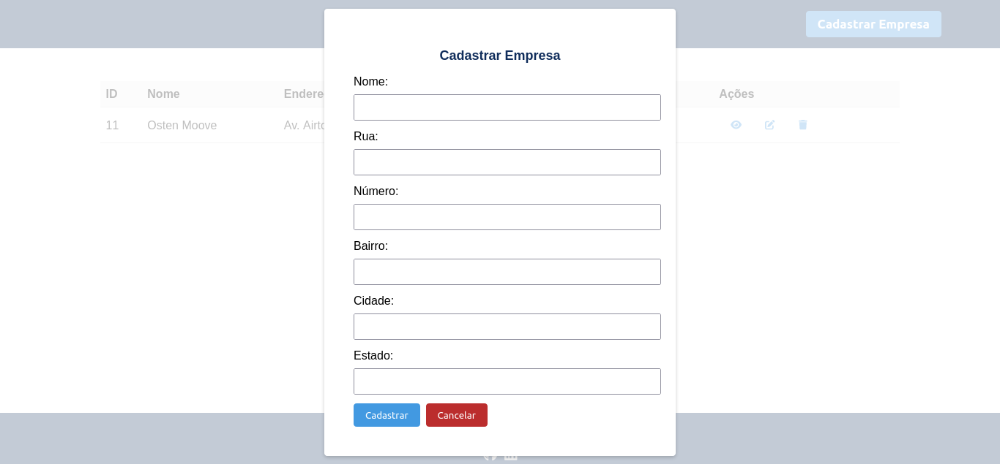

# Plataforma de Cadastro de Empresas

Este projeto consiste em uma plataforma de cadastro de empresas. A aplicação é composta por uma API back-end para cadastro de empresas e um front-end para interação com o usuário.

## Funcionalidades

A API back-end possui as seguintes funcionalidades:

- Listagem de todas as empresas cadastradas;
- Detalhamento dos dados de uma empresa pelo ID;
- Cadastro de uma nova empresa;
- Atualização dos dados de uma empresa através do ID;
- Exclusão de uma empresa através do ID.

O front-end permite ao usuário:

- Visualizar a lista de empresas cadastradas em uma tabela com as informações de ID, nome e endereço;
- Visualizar mais detalhes de uma empresa ao clicar no botão "mais detalhes";
- Editar as informações de uma empresa ao clicar no botão "editar";
- Excluir uma empresa ao clicar no botão "apagar";
- Adicionar uma nova empresa no sistema ao clicar no botão "adicionar empresa".

### Tecnologias utilizadas no Back-end:
- Node.js
- Express
- MySQL
- Sequelize
- SQLite3

### Tecnologias utilizadas no Front-end:
- React
- React Modal
- React Toastify
- FontAwesome (fontes e ícones)
- Testing Library (Jest DOM, React, User Event)
- Web Vitals
## Como rodar a aplicação

Para rodar a aplicação, é necessário ter o Node.js e o MySQL instalados na máquina.

1. Clone o repositório do projeto:

git clone https://github.com/mayararocha95/cadastrodeempresas.git

2. Acesse o diretório da API back-end:

`cd cadastrodeempresas/backend`

3. Crie um banco de dados MySQL com o nome "database" e configure as credenciais de acesso no arquivo `config/database.js`.

4. Instale as dependências da API back-end:

` npm install`

5. Inicie a API back-end:

` npm start`

6. Acesse o diretório do front-end:

` cd ../frontend`

7. Instale as dependências do front-end:

` npm install`

8. Inicie front-end:

` npm start`

## Imagens

A seguir estão algumas imagens da plataforma:

# 1. Página Principal:

   

# 2. Modal Detalhes:

   

# 3. Modal Excluir:

   

# 4. Modal Cadastrar Empresas:

   

>Criado por Mayara Rocha